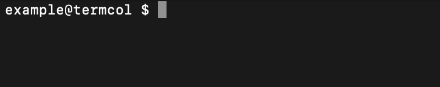

# Simple Go Terminal Colorizer

This is a simple Go package that provides a way to colorize terminal output.
It allows you to easily add colors to your terminal output without dealing directly with ANSI escape codes.

## Table of Contents

- [Installation](#installation)
- [Features](#features)
- [When to Use](#when-to-use)
- [Available Colors](#available-colors)
- [Usage Examples](#usage-examples)
- [Functions](#functions)
- [Configuration Options](#configuration-options)
- [Examples](#examples)

## Installation

To install the package, use the following command:

```bash
go get github.com/tyzes/termcol
```

## Features

- Format strings with ANSI escape codes
- Supports both color placeholders and standard `fmt` formatting

## Quick Preview

You can quickly try it out:

```go
termcol.Printlnf("&rRed &gGreen &bBlue §&FBold §&UUnderlined")
```



## When to Use

Perfect for CLIs, logs, debugging tools, or any Go program that outputs styled text to the terminal.

## Available Colors

```
| &-Code |   Color-Name   | Foreground | Background |
|  (FG)  |                |            |  (colorBg) |
|--------|----------------|------------|------------|
|   &s   | Black          |   \033[30m |   \033[40m |
|   &r   | Red            |   \033[31m |   \033[41m |
|   &g   | Green          |   \033[32m |   \033[42m |
|   &y   | Yellow         |   \033[33m |   \033[43m |
|   &b   | Blue           |   \033[34m |   \033[44m |
|   &m   | Magenta        |   \033[35m |   \033[45m |
|   &c   | Cyan           |   \033[36m |   \033[46m |
|   &w   | White          |   \033[37m |   \033[47m |
|   &a   | Gray           |   \033[90m |  \033[100m |
|   &R   | Bright Red     |   \033[91m |  \033[101m |
|   &G   | Bright Green   |   \033[92m |  \033[102m |
|   &Y   | Bright Yellow  |   \033[93m |  \033[103m |
|   &B   | Bright Blue    |   \033[94m |  \033[104m |
|   &M   | Bright Magenta |   \033[95m |  \033[105m |
|   &C   | Bright Cyan    |   \033[96m |  \033[106m |
|   &W   | Bright White   |   \033[97m |  \033[107m |
|   &F   | Bold           |    \033[1m |   ------   |
|   &I   | Italic         |    \033[3m |   ------   |
|   &U   | Underline      |    \033[4m |   ------   |
|   &S   | Strikethrough  |    \033[9m |   ------   |
|   §    | Reset          |    \033[0m |   ------   |
```

Note that these colors are based on ANSI escape codes and may not work in all terminal emulators.
They might also look slightly different depending on the terminal emulator you are using.

## Usage Examples

```go
package main

import (
	"fmt"
	"github.com/tyzes/termcol"
)

func main() {
	var s string

	// Colorize a string using default color key ('&') 
	s, _ = termcol.Sprintc("&Red &Green &Blue & &Bold-Red", termcol.Red, termcol.Green, termcol.Blue, termcol.Red, termcol.Bold)
	fmt.Println(s)
	// Note: a space in between two & will be stripped and both & will be used for formatting.
	// To print a literal '&', escape it by writing "&&"

	// Colorize a string with direct color arguments and using fmt formatting
	s, _ = termcol.Sprintf("&r%s &g%s &b%s &r&F%s §%s", "Red", "Green", "Blue", "Bold-Red", "Reset")
	fmt.Println(s)

	// Colorize a string with different formatting options
	f := termcol.NewFormatter()
	f.SetKey('!')
	s, _ = f.Sprintf("!r%s", "Red")
	fmt.Println(s)
}
```

For more examples, please refer to the [examples directory](examples).

## Functions

### Color Placeholder Functions (`*c`)

These functions accept **color/style constants** as additional arguments (e.g. `termcol.Red`, `termcol.Bold`):

- `Printc` – Prints a string using color placeholders to standard output.
- `Sprintc` – Returns a color-formatted string.
- `Fprintc` – Prints to a given `io.Writer`.
- `Printlnc` – Like `Printc`, but appends a newline.

### Formatted Output Functions (`*f`)

These work like Go's `fmt.*f` functions and accept **format strings with arguments**, not color constants:

- `Printf` – Prints a formatted string (like `fmt.Printf`).
- `Sprintf` – Returns a formatted string (like `fmt.Sprintf`).
- `Fprintf` – Prints to a given `io.Writer` (like `fmt.Fprintf`).
- `Printlnf` – Like `Printf`, but appends a newline.

### Status Helpers

These functions accept regular `fmt` arguments and automatically prepend a colored status label:

- `Successf` – Prints a green success message prefixed with `"Success:"`.
- `Warningf` – Prints a yellow warning message prefixed with `"Warning:"`.
- `Errorf` – Prints a red error message prefixed with `"Error:"`.

## Configuration Options

- `NewFormatter` - Creates and returns a new formatter instance used for formatting configuration.

All configuration options apply to the formatter instance.  
When using a custom formatter, call methods like `Printc` on that instance.  
Otherwise, the default global formatter is used.

Options available on the formatter:

- `SetKey` - Sets the key used for color codes (default is '&').
- `SetResetKey` - Sets the key used for resetting formatting (default is '§').
- `ResetAtEnd` - If true, the reset code will be added at the end of the formatted string (default is true).
- `ResetBeforeNewline` - If true, the reset code will be added before every newline (default is true).


- `SetSuccessStyle` - Sets the style for success messages (default is green, "Success: ").
- `SetWarningStyle` - Sets the style for warning messages (default is yellow, "Warning: ").
- `SetErrorStyle` - Sets the style for error messages (default is red, "Error: ").